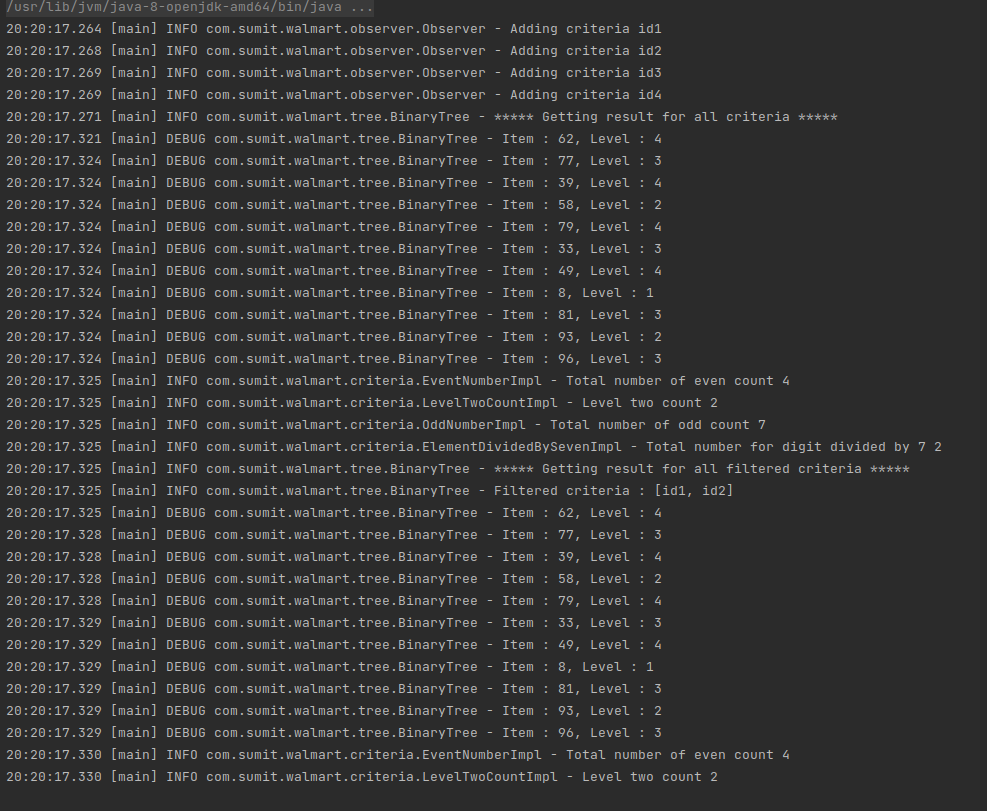

# Criteria Count finder from binary tree in single traverse

Binary Tree provides inserting elements and then apply criteria to get count against that criteria

```java
        Listener listener = new Listener();
        listener.addCriteria(new EventNumberImpl());
        listener.addCriteria(new LevelTwoCountImpl());
        listener.addCriteria(new OddNumberImpl());
        listener.addCriteria(new ElementDividedBySevenImpl());

        BinaryTree binaryTree = new BinaryTree(listener);
        for (int i = 0; i < 10; i++) {
            binaryTree.insert(randomNumber(1, 100));
        }
        binaryTree.insert(49);

        binaryTree.traverseForAllCriteria(listener);
```

Solution has been furthered optimized thinking there can be situation where user will be only interested in specific criterias even though multiple criteria are registered. In such case one more interface has been provided. In the below example you can see we are only interested for two two criteria
```java
        binaryTree.traverseForFilteredCriteria(listener, Arrays.asList(EventNumberImpl.IDENTIFIER, LevelTwoCountImpl.IDENTIFIER));

```

If some new criteria needs to be added into the system, its fairly simply by implementing 'com.sumit.walmart.criteria'  and registered it with listener. That much simple. No other code changes will be required.

## Sample output



